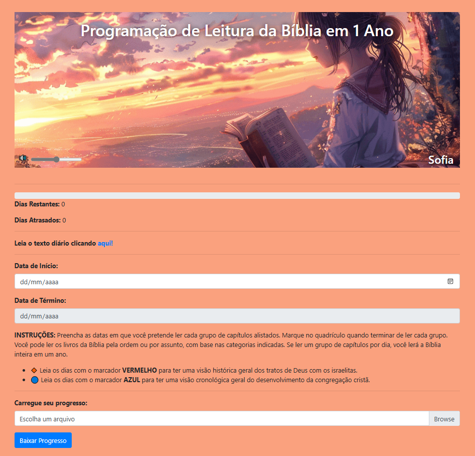
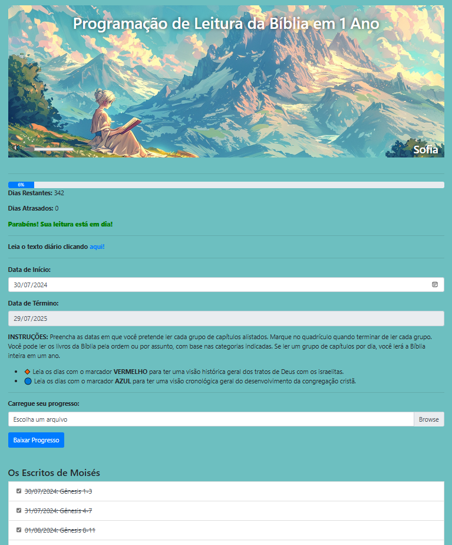

---

# Plano de Leitura da Bíblia em 1 Ano

Este projeto é uma aplicação simples para ajudar os usuários a seguirem um plano de leitura da Bíblia em um ano. Ele permite que o usuário acompanhe seu progresso de leitura, fornecendo uma interface para marcar as leituras completas, calcular os dias restantes e atrasados, além de exibir uma mensagem de parabéns quando a leitura está em dia.

## Funcionalidades

- **Plano de Leitura Diário**: O usuário pode visualizar um plano de leitura detalhado, dividido em categorias e dias, cobrindo toda a Bíblia ao longo de 365 dias.
- **Acompanhamento de Progresso**: Marque cada dia de leitura como concluído e acompanhe o progresso através de uma barra de progresso visual.
- **Dias Restantes e Atrasados**: A aplicação calcula os dias restantes e os dias de leitura atrasados, atualizando automaticamente com base nas marcações diárias.
- **Texto Diário**: Um link para o texto diário das Escrituras está disponível diretamente na página, levando o usuário ao conteúdo mais recente no site [wol.jw.org](https://wol.jw.org/pt/wol/h/r5/lp-t).
- **Personalização**: O usuário pode personalizar seu nome e o nome será salvo no navegador.
- **Download e Upload do Progresso**: A aplicação permite que o usuário baixe e carregue seu progresso de leitura, facilitando a continuidade do acompanhamento em diferentes dispositivos.

## Como Usar

1. **Data de Início**: Insira a data de início da sua leitura no campo "Data de Início".
2. **Data de Término**: A data de término será calculada automaticamente para um ano após a data de início.
3. **Plano de Leitura**: Leia os capítulos sugeridos para cada dia. Marque como concluído ao terminar.
4. **Progresso**: Acompanhe o progresso da leitura através da barra de progresso e das estatísticas de dias restantes e atrasados.
5. **Download do Progresso**: Para salvar seu progresso localmente, clique no botão "Baixar Progresso". Isso gera um arquivo JSON com os dados.
6. **Carregar Progresso**: Para carregar um progresso salvo anteriormente, utilize a opção de upload e selecione o arquivo JSON.

## Tecnologias Utilizadas

- **HTML/CSS**: Interface e estilização da página.
- **JavaScript**: Lógica para controle de progressão, armazenamento local e manipulação da interface.
- **Bootstrap**: Framework CSS para design responsivo.
- **FontAwesome**: Ícones para melhorar a interface do usuário.

## Capturas de Tela

| Descrição       | Captura de Tela                                   |
| --------------- | ------------------------------------------------- |
| Tela Principal  |  |
| Progresso de Leitura |  |

## Como Contribuir

1. Faça um Fork do repositório.
2. Crie um branch com sua feature (`git checkout -b minha-feature`).
3. Comite suas mudanças (`git commit -am 'Adicionei uma nova feature'`).
4. Faça um push para o branch (`git push origin minha-feature`).
5. Abra um Pull Request.

## Licença

Este projeto está licenciado sob a [MIT License](LICENSE).

## Contato

Caso tenha dúvidas ou sugestões, entre em contato comigo pelo WhatsApp através do botão disponível na aplicação.

---
